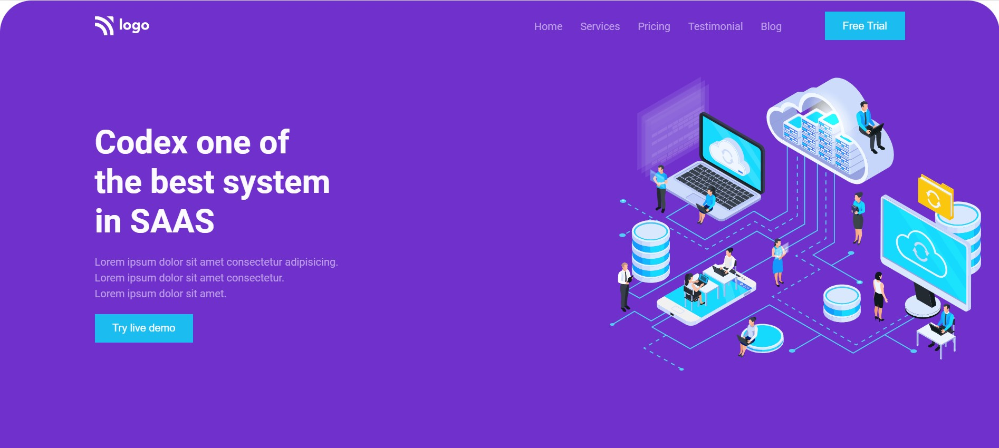
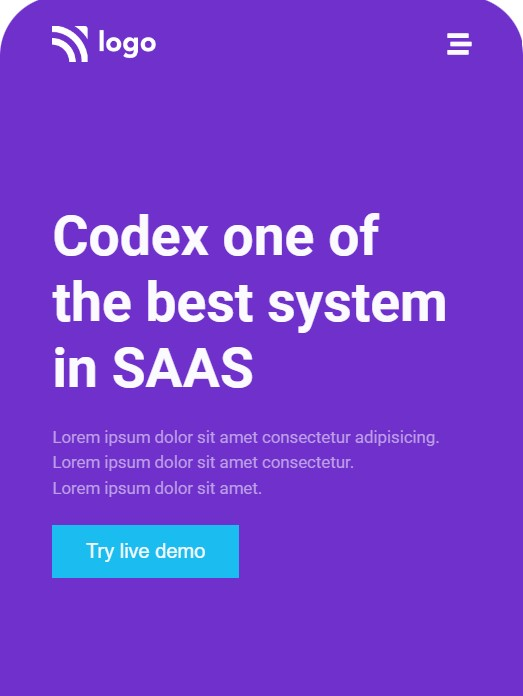

# SAAS Landing Page  

## 🛠 Technologies Used
---
  - HTML - Hyper Text Markup Language
  - CSS - Cascadeing Spread Sheet
  - JS - Javascript

## Deployed Link of the web page
---
[Click to see the webpage]()

## Author and Contact
---
- [Anurag katiyar](https://github.com/anuragkatiyar1994)
- anuragkatiyar1994@gmail.com 
## Time to finish the project
---

I took around 5 hours to complete this project.
I have used css flex box and position. I have learned how to place the images correctly.

## Feedback
---

If you have any feedback, please reach out to us at anuragkatiyar1994@gmail.com